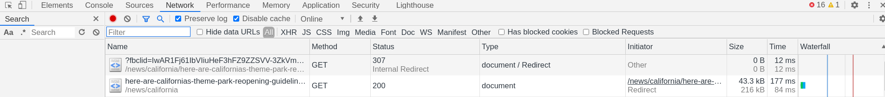
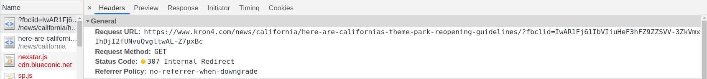
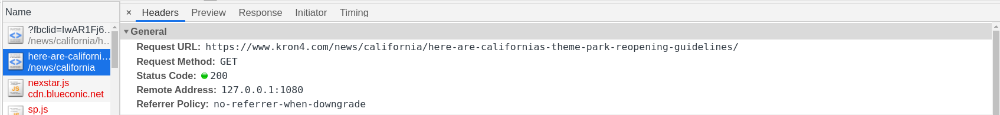

# Tracking remover

Chrome extension for removing tracking such as `fbclid` and `utm_source`.

## Installation

1. Clone the repo to wherever-you-like
2. Navigate to `chrome://extensions` on Chromium.
3. Load unpacked

## Technical details and limitations

- This plugin leverages the `chrome.webRequest.onBeforeRequest` API to inspect all request URLs.
- If tracking parameter (such as `fbclid`) found in the URL parameters, it immediately issues a redirection to the same URL *without* the parameters.
- Since `chrome.webRequest.onBeforeRequest` is monitoring on the callee URL, this extension requires the permission with `<all_url>`.

## Screenshots

## Development

- `chromium --auto-open-devtools-for-tabs` is really handy. :D
- Use `prettier --tab-width 4 -w *.{js,json}` to format files.

## See also

- [Neat-URL](https://github.com/Smile4ever/Neat-URL)
- [ClearURLs](https://github.com/ClearURLs/Addon/)
- [uBlock-issues/issues/1356](https://github.com/uBlockOrigin/uBlock-issues/issues/1356)
